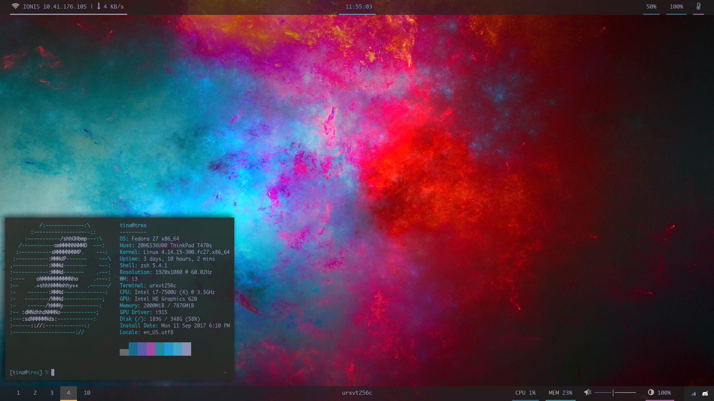
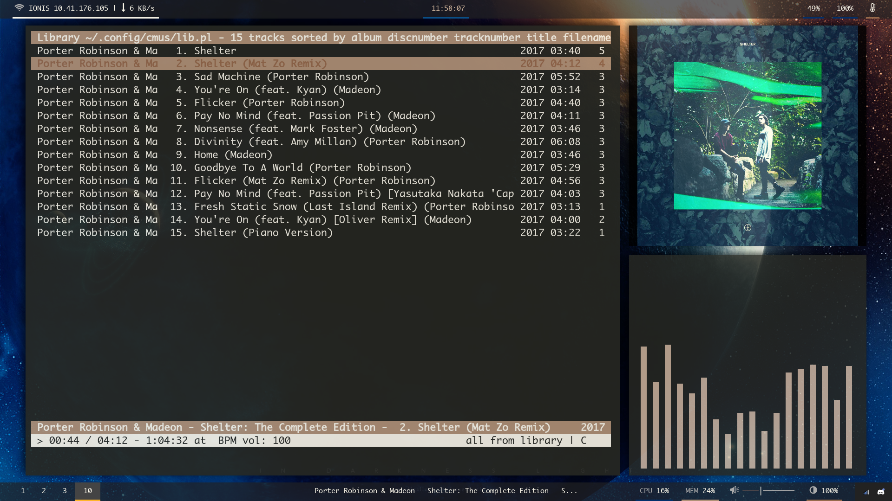

# My Linux Rice :rice_ball:

## TL;DR
- OS: [Fedora Linux](https://getfedora.org/) [27](https://fedoramagazine.org/announcing-fedora-27/), upgraded from Fedora Linux [26](https://fedoramagazine.org/fedora-26-is-here/) ([Xfce Spin](https://spins.fedoraproject.org/en/xfce/)) :cd:
- WM/DE: [i3](https://i3wm.org/) :computer:
- Terminal: [URxvt](http://software.schmorp.de/pkg/rxvt-unicode.html) (256 colors) :arrow_forward:
- Bars: [polybar](https://github.com/jaagr/polybar) :bar_chart:
- File manager(s): [ranger](https://ranger.github.io/), [Thunar](https://docs.xfce.org/xfce/thunar/start) and [Nautilus](https://wiki.gnome.org/action/show/Apps/Files?action=show&redirect=Apps%2FNautilus) :file_folder:
- Editor: [vim](http://www.vim.org/) with the [molokai](https://github.com/tomasr/molokai) color scheme. :pencil2:
- Music player: [cmus](https://cmus.github.io/) with [cava](http://karlstav.github.io/cava/) as a visualizer and [skielred/bum](https://github.com/skielred/bum) to display album arts :musical_note:

## Screenshots showcase
Just neofetch

Just rofi

Just vim

Just ranger

cmus, cava and bum

# What's in this repo
- All of my desktop configuration that resides in user land. I basically symlink files from this repo to the correct path and use them exactly like how they are here.
- An installation script for the packages I use if you use Fedora. Just `cd` to this repo after you cloned it somewhere and run `./install_softwares.sh`. It's an interactive script that will introduce every software I use and ask if you want to install them.
- An installation script for the vim plugins I use (suggesting you have a plugin manager, I use [pathogen](https://github.com/tpope/vim-pathogen). Just `cd` to this repo after you cloned it somewhere and run `./vim-plugins.sh`.
- A script to symlink every configuration files from this repo to their corresponding location in your home directory. Makes sure you cloned this repo to a safe and permanent place, maybe fork it, and then `cd` to it and run `./symlink.sh`. The script will ask for confirmation for every folder (neofetch, i3, etc).
