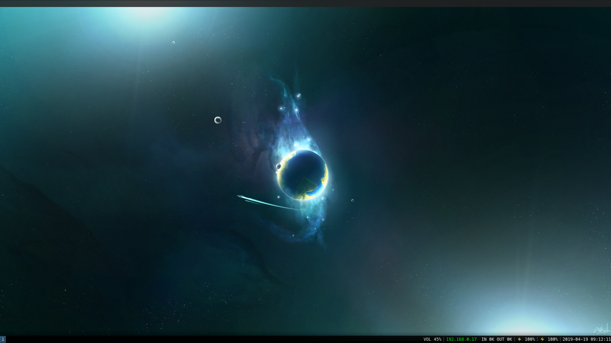
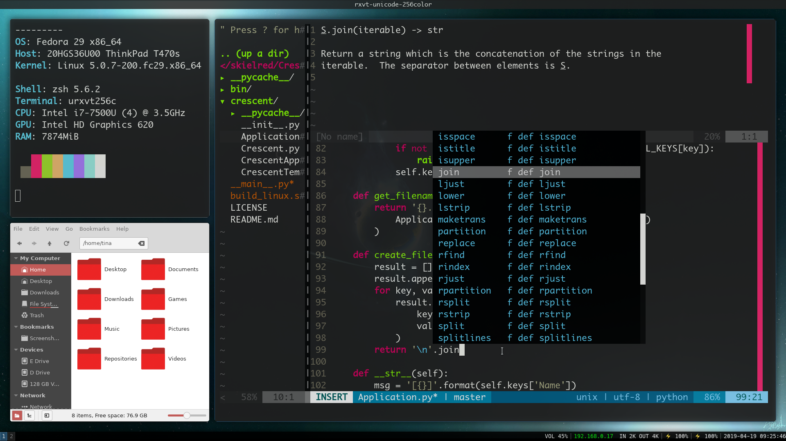
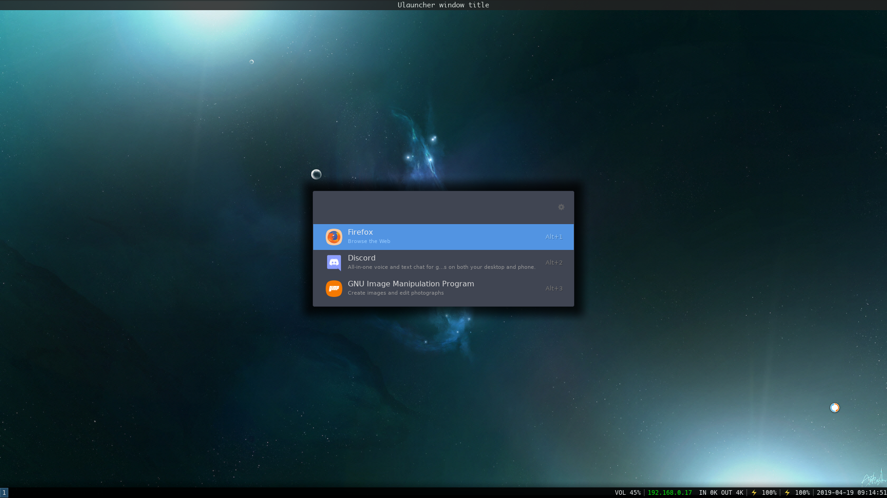
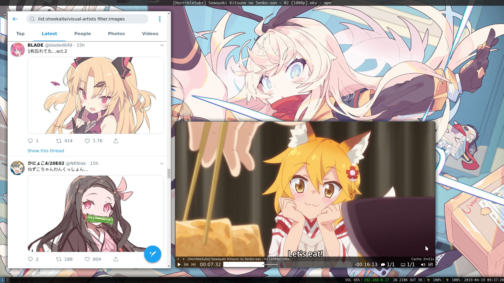

# :rice: Tina's Dotfiles

## What are Dotfiles?
A dotfile is a commonly misused word to talk about configuration files, because
configuration files often begin with a dot (.), e.g., `.bashrc`.

## Why publishing them?
1. **For personal use**: Having them available on GitHub helps me syncing my
configuration files across devices, making me faster to use a new machine. It
also serves as a back-up if anything goes wrong.
2. **To share knowledge**: Sometimes manpages aren't enough. Seeing how other
people use and configure their software can help you understand what are the
possible scenarios for a program, or help you learn stuff you didn't know.
3. **To help beginners getting started**: My dotfiles are voluntarly
unoponionated. Nothing in my dotfiles should reflect my personal use-case,
nothing is tied to how or where I store files or to my personal habits. This
might help people not advanced enough getting a beautiful desktop base.

## Screenshots showcase

Nothing


Vim, Nemo and Neofetch


Just Ulauncher


Twitter and MPV


## Quick setup
1. Clone this repository somewhere you won't move it. I store it in
`~/Repositories/skielred/Dotfiles`.
2. Go to your `~/.config` directory.
3. Create symlinks of the configuration folder from the softwares you want,
e.g., `ln -s ../Repositories/skielred/Dotfiles/i3 .` (maybe do backups first)
4. Create additional symlinks for softwares that don't store their configuration
in `~/.config`.
```bash
cd ~
ln -s .config/bash/bashrc .bashrc
ln -s .config/zsh/zshrc .zshrc
ln -s .config/x11/Xresources .Xresources
# etc...
```

## Tips

### Extending the packages repositories on Fedora

Default Fedora packages policy is to authorize stricly free software only. There
are softwares which are free (doesn't cost money) but don't release all of their
source code publicly. And you may want some of those softwares directly from
your package manager.

RPMFusion is a very popular repository (made of multiple big user-maintained
repositories). You will find a lot of softwares in it such as Steam.
[Installing RPMFusion](https://rpmfusion.org/Configuration)

Fedora also has a user-maintained repositories system called **copr**. This is
similar to ArchLinux's AUR. You have to enable a user's repository, then you can
install a package from it as if you were trying to install it normally.

Example:
```bash
dnf copr enable user/repo
dnf install package
```

Notable copr repositories I have enabled:
```bash
dnf copr enable nforro/i3-gaps # i3 fork with sexy gaps between windows
dnf copr enable shengis/i3blocks # i3bar status tool
dnf copr enable shymega/maim-copr # simple CLI screenshot tool
dnf copr enable appelond/google-play-music-desktop-player # music player
```

The list will grow as more useful tips comes to my mind.

## Softwares recommendation

### In the terminal

| Software | Purpose | Dotfile? | Do I use it? | Notes |
| -------- | ------- | -------- | ------------ | ----- |
| urxvt    | Terminal emulator | ✔️  | ✔️  | Fastest terminal emulator I've tried. Only emulator I know of which runs at this speed, noticeable on programs with lots of frame updates such as music visualizers. It can be configured through Perl extensions. 
| Bash     | Shell   | ✔️        | :x:          | You should learn it at least for scripting purpose, as it is present in a lot of systems, it's a reliable way to write portable scripts. |
| Zsh      | Shell   | ✔️        | ✔️  | Similar and compatible to Bash but with a lot of very useful improvements. |
| Vim | Text or code editor | ✔️  | ✔️  | I use it for everything. I live in Vim 24h/7j. Btw do `Escape` then type `:q!` to force quit it, hope I saved your day. |
| [Git][git] | Version control software | ✔️  | ✔️  | I use Git to version control everything I do, from small coding projects to my phone's contacts address book. Way too powerful and simple to use. |It also hides very cool features such as being able to display images, faking transparency, or even tabs. |
| [neofetch][neofetch] | Flexing tool | ✔️  | ✔️  | The mandatory script to run in a terminal window before taking a screenshot of your desktop. |
| htop | Process manager | ✔️  | ✔️  | Equivalent of Windows' Task Manager. Use it to track down which applications use a lot of resources with the ability to kill them from the manager. |
| ranger | CLI file browser | ✔️  | :x: | Used to use it, but I started to do a lot of complicating file browsing tasks such as using network locations, I needed a GUI tool. Still dope and very sexy to browse from your terminal, I highly recommend giving it a try. |

### On the desktop
| Software | Purpose | Dotfile? | Do I use it? | Notes |
| -------- | ------- | -------- | ------------ | ----- |
| [i3][i3] | Tiling window manager | ✔️  (i3-gaps) | :x: | The perfect window manager. Fast, simple to learn and configure. Lots of possibilities.
| [i3-gaps][i3-gaps] | i3 fork | ✔️  | ✔️  | i3 but with the ability to configure gaps between windows. Makes everything 100 times sexier. |
| [polybar][polybar] | Status bar | :x: | ✔️  | Easy to configure and to make pretty status bar. |
| i3bar | Status bar | :x: | ✔️  | i3's natively supported status bar. |
| [Ulauncher][ulauncher] | Application launcher | :x: | ✔️  | Good looking application launcher with a web-based settings interface. [I wrote an extension to run terminal commands from it, with auto-complete support][ulauncher-shell]. |
| [LightDM][lightdm] | Display manager | ✔️  | ✔️  | Lightweight display manager. The display manager is the program that greets you and ask you to log in, with the possibity to pick between the different desktop softwares installed. |
| compton | Compositor | ✔️  | ✔️  | A compositor is a program that adds shadows, transparency and effects to the desktop windows. Think shader but for your desktop.

### Utilities
| Software | Purpose | Dotfile? | Do I use it? | Notes |
| -------- | ------- | -------- | ------------ | ----- |
| maim | Screenshot tool | ✔️  (i3 keybinds) | ✔️  | Simple and efficient screenshot tool. I had less problems with it than with scrot. See [my i3 config](i3/config) to see how I use it (Print key and Shift+Print bindings). |
| youtube-dl | Websites wrapper/CLI tool | | ✔️  | Download or stream media from almost any video service existing on Earth. From, of course, YouTube, to many less known sites and even music sites such as SoundCloud. `youtube-dl "$playlist_url" -x --audio-format=mp3`. |
| [Fusuma][fusuma] | Touchpad gestures | ✔️  | ✔️  | Must have if you use a laptop. Bind gestures such as swiping with 3 fingers to commands. Most common use case is previous/next page by swiping left/right. |
| [Crescent][crescent] | Application entries generator | ✔️  | ✔️  | A program I made to generate [Desktrop Entries][desktop entries] easily. |
| ImageMagick | Image editing library/CLI tool | | ✔️  | You must learn to use it. It's very useful and powerful. The simplest tasks you'll want to learn is converting between formats. It's as simple as `convert from_image.png to_image.jpg`. |
| ffmpeg | Video processing library/CLI tool | | ✔️  | Same reasons. You'll be doing `ffmpeg -i from_video.flv to_video.mp4` quite often. |

### Applications
| Software | Purpose | Dotfile? | Do I use it? | Notes |
| -------- | ------- | -------- | ------------ | ----- |
| feh | Image viewer | :x: | ✔️ | Stupid and simple image viewer. No actual GUI. Just opens media in a window, controls can be done through keyboard. Can also be used to set a wallpaper. |
| [mpv][mpv] | Media player | ✔️  | ✔️  | Stupid and simple media player. No actual GUI. Just opens media in a window, controls can be done through keyboard |
| Nemo | File browser | :x: | ✔️  | Nemo is the file browser made for and by the guys of Linux Mint. It's a fork of the file browser called Nautilus, it's slightly prettier. |
| [GMusic Desktop Player][gpmdp] | Music player | :x: | ✔️  | Google Play Music Desktop Player. A wrapper arround the Play Music website made in Electron with desktop integration in mind. |
| Firefox | Internet browser | :x: | ✔️  | Fast. Containers support (separate history/data per site). Sync. Add-ons support on mobile. |
| Chrome | Internet browser | :x: | ✔️  | Smooth performances. Fake app mode (launch any website without titlebar/buttons), perfect to create pseudo-webapps for Twitter, TweetDeck, or other sites. |

The list will grow as more softwares that deserve to be recommended comes to my
mind.

## Need help?

Maybe [open an issue](https://github.com/skielred/Dotfiles/issues/new) or ask me
on Twitter @[Shookaite](https://twitter.com/Shookaite) or Discord Tina#0573.

[git]: https://git-scm.com
[mpv]: https://mpv.io
[neofetch]: https://github.com/dylanaraps/neofetch
[fusuma]: https://github.com/iberianpig/fusuma
[i3]: https://i3wm.org
[i3-gaps]: https://github.com/Airblader/i3/
[lightdm]: https://github.com/CanonicalLtd/lightdm
[crescent]: https://github.com/skielred/Crescent
[desktop entries]: https://specifications.freedesktop.org/desktop-entry-spec/desktop-entry-spec-latest.html
[gpmdp]: https://www.googleplaymusicdesktopplayer.com/
[polybar]: https://github.com/jaagr/polybar
[ulauncher]: http://ulauncher.io
[ulauncher-shell]: https://github.com/skielred/Ulauncher-Shell
